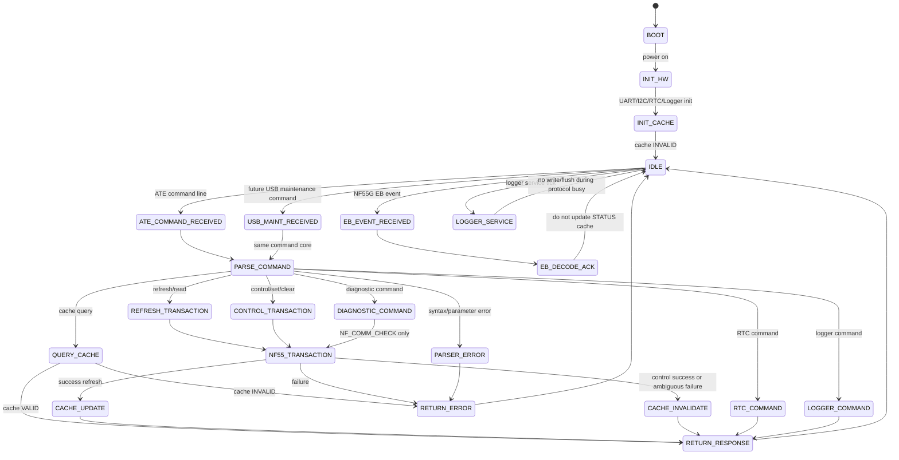
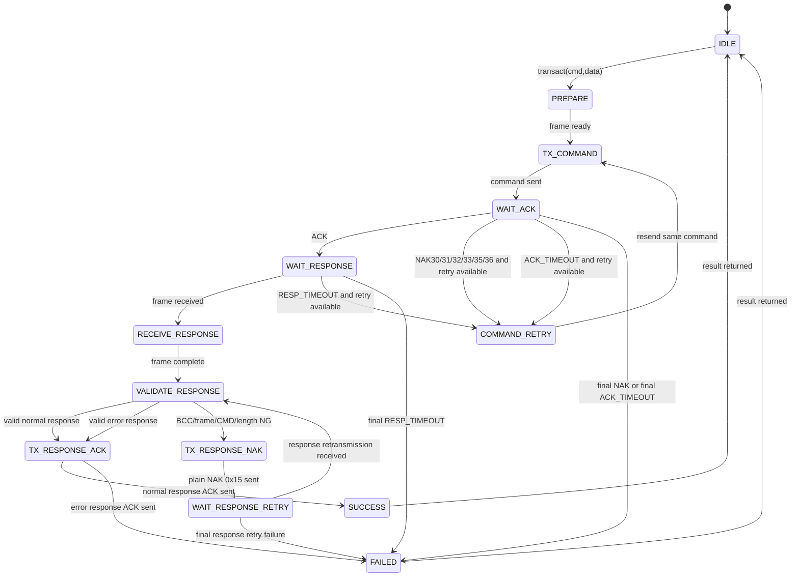
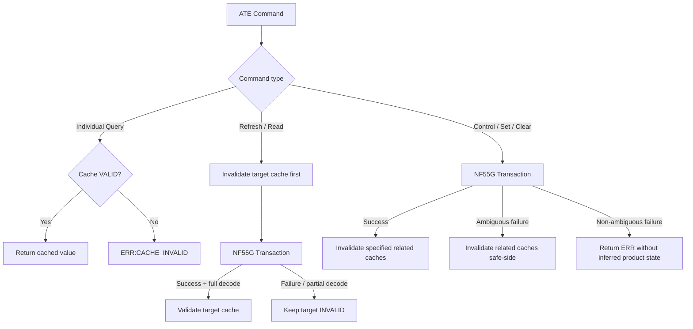
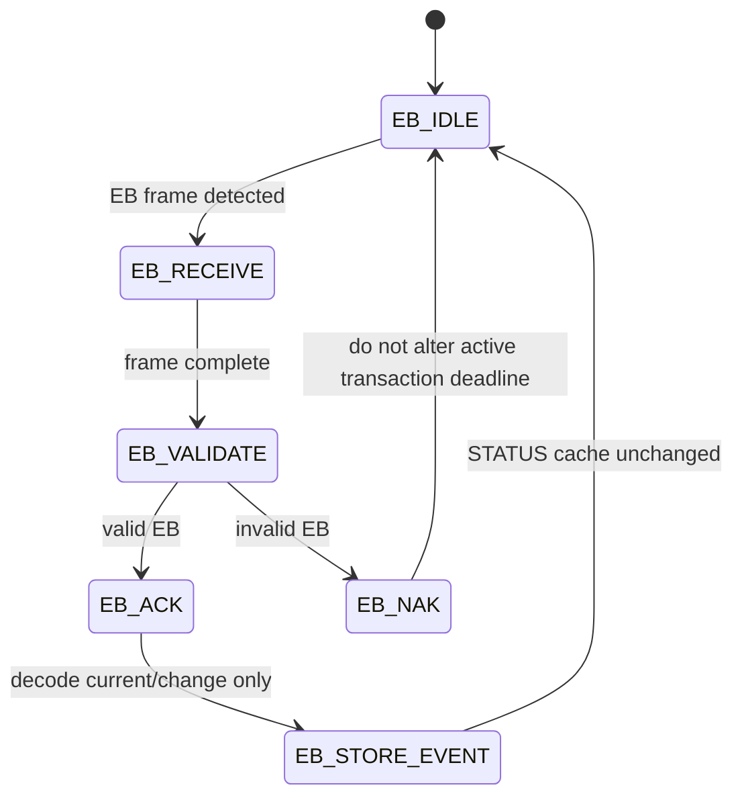

# Program State Transition Diagram
Revision: Rev.0-draft
Date: 2026-09-02

## 1. 目的
本書は、NF55G Pico 試験治具ソフトウェアのプログラム遷移、および NF55G protocol transaction の遷移図を準備するための文書である。

実装・試験・レビュー時に、処理の責務分離と state transition を確認するために使用する。

## 2. 適用範囲
- 全体プログラムの起動/待受/コマンド処理/保守処理の概要遷移。
- NF55G 1 transaction の ACK/NAK/timeout/response retry 遷移。
- EB event の扱い。

対象外:
- 製品 PASS/FAIL 判定。これは ATE 側責務。
- USB CDC 詳細 protocol。Rev.0 では deferred。
- Real NF55G HIL で未確定の timing 差異の確定。

## 3. 全体プログラム遷移

## 4. NF55G Transaction 詳細遷移

## 5. Cache 影響の概要

## 6. EB Event の扱い

## 7. 遷移図作成時の注意
- NF55G Transaction は常に 1 件のみ。同時実行しない。
- Command Retry と Response Retry は別管理する。
- Pico から NF55G Response に対して送る NAK は plain `0x15` とし、Reason Code を付けない。
- Control Response 内の Status、D0 内の Status、EB Event で `STATUS` Cache を更新しない。
- D0 内の Manufacturing/Parameter を `INFO` Cache へ昇格しない。
- Partial Decode の結果を VALID Cache に保存しない。
- `FW_UPDATE` / `FU` は NF55G へ送信しない。

## 8. 参照仕様
- `AGENTS.md`
- `docs/Protocol_State_Machine.md`
- `docs/Software_Module_Interface.md`
- `docs/Cache_Master.md`
- `docs/ATE_Command_Master.md`
- `src/nf55_protocol.py`
